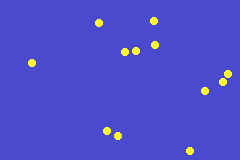

# Bouncers
An exercise to learn about functions and classes.

A bunch of sprites that bounces around user's display. Everytime a user adds a sprite, the main background color of display changes.

Githuh Pages: https://jpbooya.github.io/bouncers/

